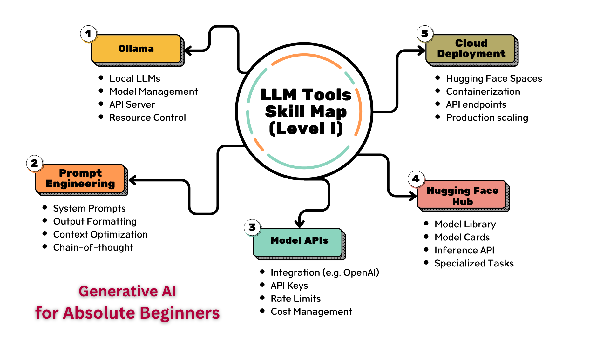
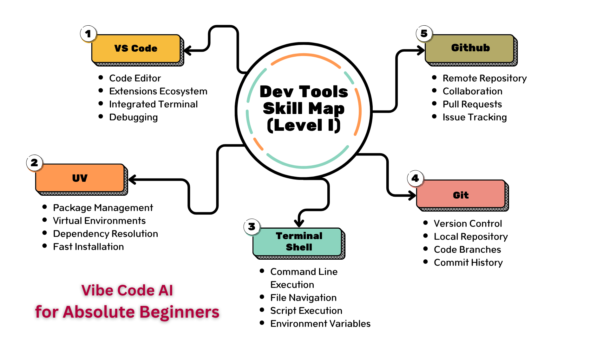

#  🧠 Study Guides 

This repository contains Study Guides for Generative AI for Absolute Beginners and Vibe Code AI for Absolute Beginners. The study guides follow the Skill Maps depicted below.

## Generative AI for Absolute Beginners - LLM Tools Skill Map (Level I)

## Vibe Code AI for Absolute Beginners - Dev Tools Skill Map (Level I)

